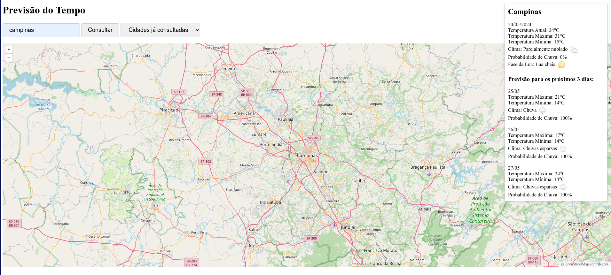

# weather-forecast-system
Sistema de previsão de tempo de cidades, com mapa interativo

# Pré-requisito (Recomendado) 
- Node >=18

## Ferramentas (Principais)
- Fastify
- Selenium
- Vite
- Vitest
- Zod


## Back-end
A Api REST deste sistema foi programada utilizando Node js com o framework Fastify.

## Front-end
Foi utilizado para o front-end do sistema html, css e javascript puros. Para exibição do mapa, foram utilizadas as bibliotecas OpenLayers e Vite.

## Instalando Bibliotecas
Clone o repositório em uma pasta local, na raiz do projeto, rode os comandos
```
cd back-end
npm install
cd ..
cd front-end
npm install
```

## Criando Arquivo .env
Para executar a aplicação, é necessária a criação de um arquivo ".env" dentro da pasta back-end. Em anexo há um arquivo ".env.example", contendo as variáveis necessárias, porém note que será necessária a inserção das chaves "HG_BRASIL_API_KEY" e "OPEN_WEATHER_MAP_API_KEY" referentes respectivamente às APIs externas de previsão de tempo e de geolocalização. Elas podem ser obtidas gratuitamente entrando nos links de referência 1 e 2, descritos na última seção, após a realização de cadastro. A variável NODE_ENV pode continuar com o valor "dev".


## Rodando o Sistema Localmente
O servidor back-end irá rodar na porta 3333 e o servidor front-end irá rodar na porta 5173, certifique-se antes que elas estejam livres.

Para rodar o sistema localmente, inicialmente rode o servidor back-end, executando o comando na raiz do projeto em terminal:
```
cd back-end
npm run dev
```
o servidor back-end deverá estar rodando na porta 3333.

Agora abra um segundo terminal e na raiz do projeto rode o servidor front-end, executando o seguinte comando:
```
cd front-end
npm run start
```
o servidor front-end deverá estar rodando na porta 5173 e poderá ser acessado via browser no endereço http://localhost:5173/

Após estes passos, o sistema estará rodando, mostrando um mapa, um input de texto para inserir o nome da cidade, um botão "Consultar" e um drop-down com as cidades já consultadas anteriormente e mantidas em cache pelo front-end, como mostrado na imagem.



## Testes
Foram criados testes unitários e testes e2e.

Os testes unitários foram criados utilizando dados em memória que simulam resultados da requisição às APIs externas.

Foi utilizada a biblioteca Vitest para o desenvolvimento dos testes unitários.

Para rodar os testes unitários, na raiz do projeto use os comando:
```
cd back-end
npm run unit-tests
```

Já os testes end to end, que testam desde a inserção da cidade no browser Google Chrome, até a resposta da requisição pela API, foram criados utilizando a biblioteca Selenium. Certifique-se que sua máquina possui o Google Chrome instalado. Para executar os testes e2e, execute os comandos na raiz do projeto:

```
cd back-end
npm run e2e-tests
```


## Links de Referência
1- https://hgbrasil.com/

2- https://openweathermap.org/

3- https://openlayers.org/

## Contribuidores
* Andre Kizo da Rosa